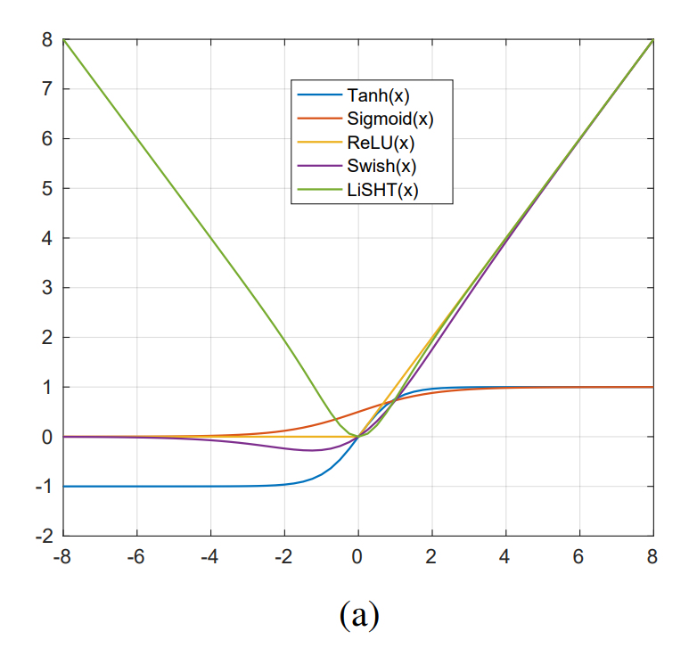
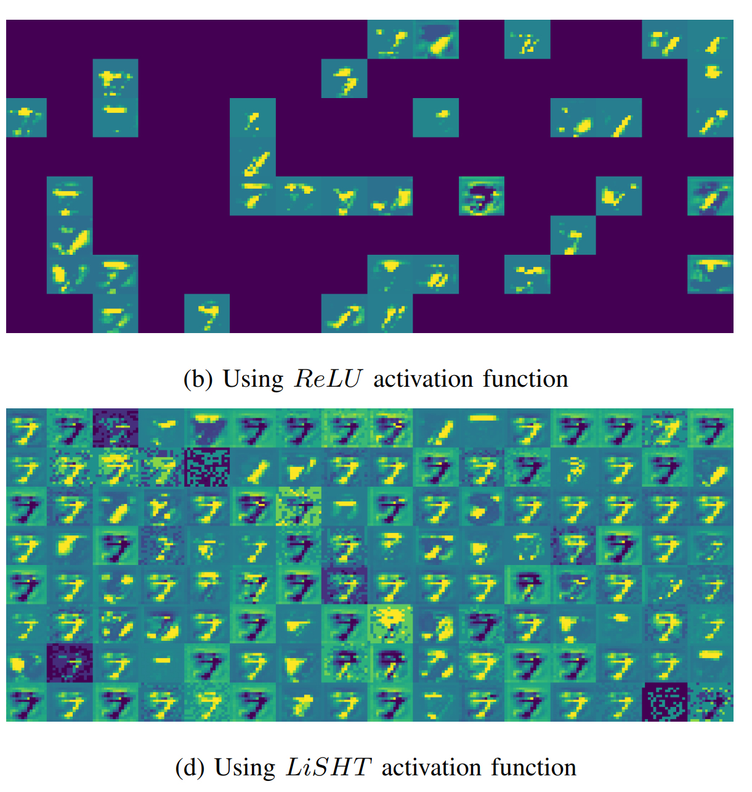
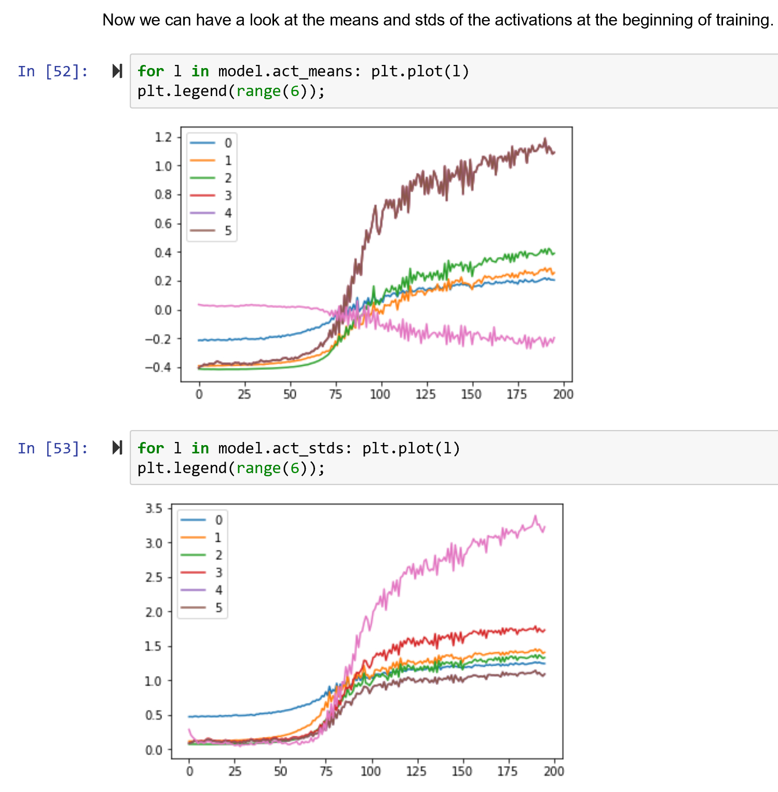
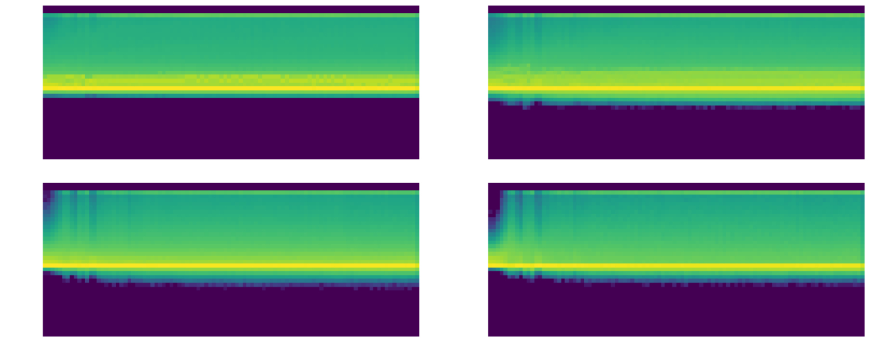
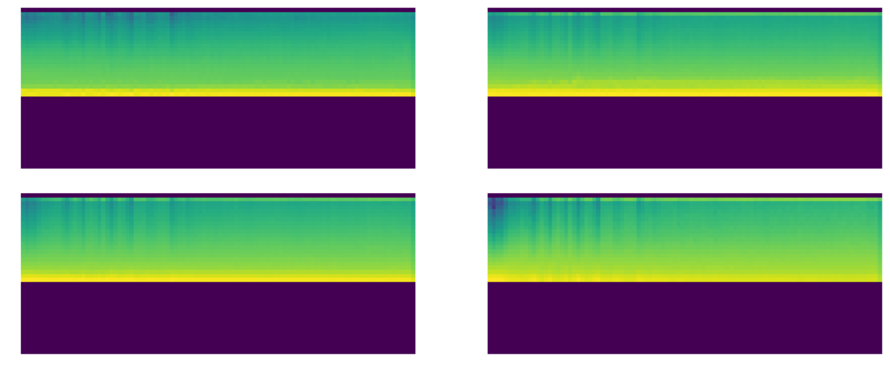

# LightRelu
Customized PyTorch implementation of LiSHT (linear scaled hyperbolic tangent) activation function for deep learning, with mean shift and clamping.

Original paper here:

#LiSHT: Non-Parametric Linearly Scaled Hyperbolic Tangent Activation Function for Neural Networks
https://arxiv.org/abs/1901.05894

Activation map comparison:

MNIST - Relu vs Lisht:

# LightRelu = customized LiSHT in PyTorch, with mean shift and clamp:

I implemented using Pytorch and wrapped it with a clamp and mean shift.(.46 and 7.5).  
More testing in progress, but so far looks very promising!  
Note - cut your learning rates in half vs ReLU, it learns very rapidly.

# Comparisons of LightRelu vs ReLU and General Relu 
(GeneralRelu is an upcoming Relu with leakiness, mean shift and clamp):

# ReLU:

# LightRelU:

# Histogram of activations (smoother is better) - General ReLU vs LightRelu:

# GeneralReLU:

# LightRelU:

